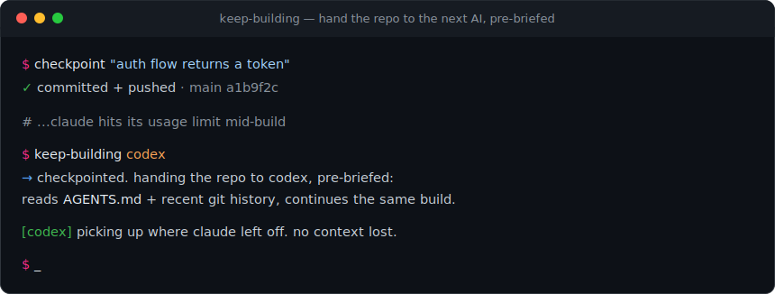

# keep-building



**Never lose coding momentum when one AI runs out.**

AI coding assistants (Claude Code, OpenAI Codex, Gemini) each have their own usage
limits. When the one you're using hits its cap, you're blocked, and you lose the
thread of what you were doing. `keep-building` fixes that with two tiny commands.

The idea is simple: **your files and git history are the shared brain.** Any AI can
open the same repo and keep going. The only thing that does not carry over is the
chat, so you externalize the plan into the repo, and swap.

## Two commands

**`checkpoint "what works"`**
Stage everything, commit, push. The keystone habit. Run it every time something
works. A clean tree means you can hand the repo to any other AI, and any mistake is
one `git checkout` away.

**`keep-building [codex|gemini]`**
One AI ran out? Run this. It checkpoints your work, then launches the next agent in
write mode, pre-briefed to read `AGENTS.md`, see the recent git history, and continue
the same build. Codex first (closest to Claude for code), Gemini as a second fallback.

## Why it works

- **Separate usage buckets.** Claude, ChatGPT/Codex, and Gemini bill independently.
  When one window is exhausted, the next is fresh. Three buckets is roughly triple
  your continuous building runway.
- **Files + git are the shared state.** Every agent edits the same workspace. Swapping
  the model never touches your code, only the conversation, which you replace with an
  `AGENTS.md`.
- **`AGENTS.md` is the cross-agent rulebook.** Codex and Gemini read it the same way
  Claude reads `CLAUDE.md`. One file, consistent behavior, no matter who is driving.

## Install

```bash
git clone https://github.com/kalaniandrez/keep-building
cd keep-building
./install.sh            # installs to ~/.local/bin (pass a dir to override)
```

Make sure the install dir is on your `PATH`.

## Use

```bash
# build normally, then every time something works:
checkpoint "auth flow returns a token"

# the AI you are using runs out? hand off and keep going:
keep-building codex
```

Drop an `AGENTS.md` in your repo (copy `AGENTS.md.example`) so every agent follows the
same rules and picks up context cleanly.

## Automate the habit

Forget to checkpoint? Let cron do it. Commit and push every night:

```cron
30 23 * * *  cd /path/to/repo && /home/you/.local/bin/checkpoint "nightly auto-save"
```

(On macOS a launchd agent does the same thing.)

## Requirements

- `git`
- Whichever agent CLIs you use, each authenticates with its own subscription:
  [Claude Code](https://github.com/anthropics/claude-code),
  [OpenAI Codex CLI](https://github.com/openai/codex),
  [Gemini CLI](https://github.com/google-gemini/gemini-cli).

## How a handoff actually feels

```
$ keep-building codex
  committed a1b2c3d  (4 files)
  pushed to origin/main
  launching codex in write mode with full repo context...

codex> Current task: wire the password-reset email template into the auth service.
codex> Continuing...
```

Same repo, same task, different brain. You never stopped.

## License

MIT, see [LICENSE](LICENSE).
